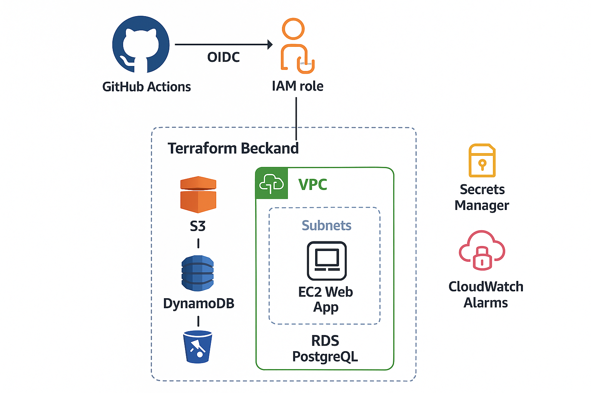

= DevOps AWS Challenge
Dragan Siljanovski
:toc:
:toclevels: 3

== Terraform AWS Infrastructure — Deployment Guide

This project demonstrates a complete Terraform setup for deploying AWS infrastructure using GitHub Actions with OpenID Connect (OIDC).

It includes:

* Remote state backend (S3 + DynamoDB)
* GitHub OIDC trust and IAM role
* Full application infrastructure (EC2 + RDS + VPC)
* Automated CI/CD deployment using GitHub Actions
* Additional: Secret Manager for DB password and CloudWatch alarms

The goal is to enable fully keyless infrastructure deployment without AWS Access Keys.

---

== Directory Structure

[source]
----
terraform/
├── backend/     # S3 bucket + DynamoDB table for Terraform remote state
├── oidc/        # GitHub OIDC provider + IAM role for GitHub Actions
└── infra/       # EC2, RDS, VPC, SGs, user-data application
----

Each module is applied independently.

---

== 1. Prerequisites IAM user permissions

To bootstrap the Terraform backend (S3 + DynamoDB) and the GitHub OIDC module, the user must temporarily have broad IAM permissions.
This is required because the AWS Terraform provider performs many implicit read operations (Get*, List*, Describe*) across IAM, S3, and DynamoDB, which are not explicitly declared in the provider documentation but are necessary during resource creation.
Although Terraform creates only a few IAM, S3, and DynamoDB resources, AWS internally calls many APIs.

=== Required bootstrap permissions
[source]
----
{
  "Version": "2012-10-17",
  "Statement": [
    {
      "Effect": "Allow",
      "Action": ["iam:*"],
      "Resource": "*"
    },
    {
      "Effect": "Allow",
      "Action": ["s3:*"],
      "Resource": "*"
    },
    {
      "Effect": "Allow",
      "Action": ["dynamodb:*"],
      "Resource": "*"
    },
    {
      "Effect": "Allow",
      "Action": [
        "sts:GetCallerIdentity",
        "ec2:Describe*"
      ],
      "Resource": "*"
    }
  ]
}

NOTE:
These permissions are required only during bootstrap.
After the backend and OIDC provider are created, they should be replaced with minimal, least-privilege IAM roles used by GitHub Actions through OIDC.
----
---

== 2. Deployment Steps using GitHub Actions

=== Step 1 — Create Terraform state (S3 + DynamoDB)

Trigger GitHub Actions pipeline:

https://github.com/siljabg/devops-aws-challenge/actions/workflows/terraform_state.yml[Terraform State Workflow]

This creates:
* S3 bucket (globally unique)
* DynamoDB lock table

IMPORTANT:
*Do NOT destroy the backend module once created.*

---

=== Step 2 — GitHub OIDC provider + IAM role

https://github.com/siljabg/devops-aws-challenge/actions/workflows/oidc.yml[OIDC Workflow]

Creates:
* GitHub OIDC provider
* IAM role: `github-actions-terraform`
* Terraform execution policy + attachments

IMPORTANT:
*OIDC module uses LOCAL state — intentionally no remote backend*.

This prevents a situation where destroying remote backend breaks authentication.

---

=== Step 3 — Deploy full application infrastructure

https://github.com/siljabg/devops-aws-challenge/actions/workflows/Infra_deploy.yml[Diploy Infra Workflow]

Creates:
* VPC + subnets + route tables
* RDS PostgreSQL
* EC2 instance + user-data application
* Security Groups
* Secret Manager entry (DB password)
* Outputs: public IP, DB endpoint, alarms

Uses remote S3 state.

---

== 3. Terraform Destroy Rules

=== Safe to destroy
https://github.com/siljabg/devops-aws-challenge/actions/workflows/Infra_destroy.yml[Distroy Infra Workflow]

Destroys all resources deployed from `terraform/infra`.

=== DO NOT destroy
* `terraform/backend`
* `terraform/oidc`

Do not destroy if you still plann to use infra.
Destroying backend removes Terraform state.  
Destroying OIDC breaks GitHub authentication permanently.

---

== 4. Required Changes Before Reuse

Anyone using this repo must change:

1. S3 bucket name (must be globally unique)
2. AWS region - proposed is eu-central-1
3. Instance sizes (EC2, RDS)

---

== 5. Accessing the Application After Deployment

After the *Deploy Infra* GitHub Actions pipeline completes successfully, Terraform will output important connection values, including:

* EC2 public IP address - public address of the Flask application
* RDS endpoint - PostgreSQL connection endpoint
* EC2 alarms - CPU and status checks
* RDS alarms - CPU and low storage checks

=== How to open the application

GitHub Actions workflow now prints a clean deployment URL at the end of the run: example

- Open in browser: http://18.199.153.7/

You can simply click the link in the Actions logs — no manual Terraform output reading required.

=== What the Application Displays

The page displays a clean HTML table with 5 tennis players sorted by number of Grand Slam titles.

=== How the Application Works

The Flask web application is deployed automatically on EC2 using user_data.
When the instance starts:

- Flask is installed
- Python app is copied to the instance
- Systemd service starts the app automatically
- App listens on port 80